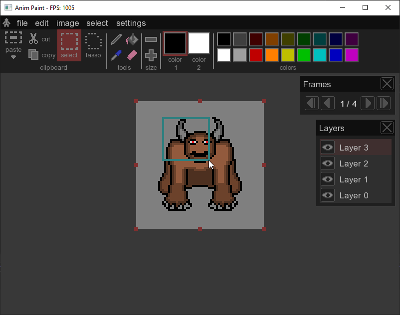
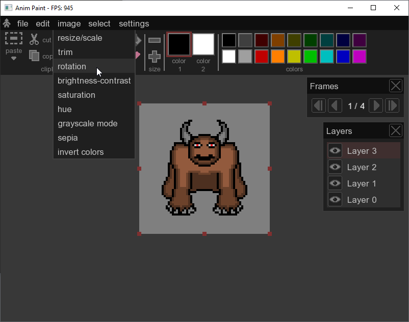
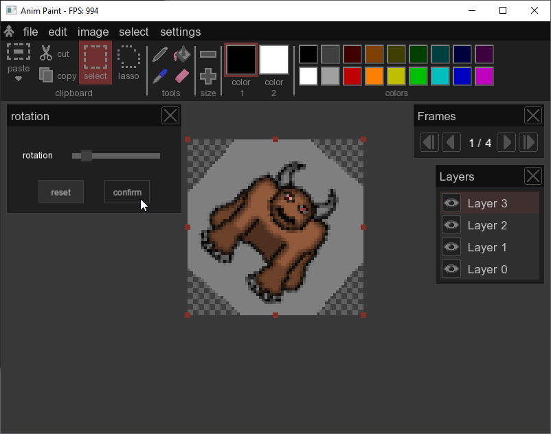
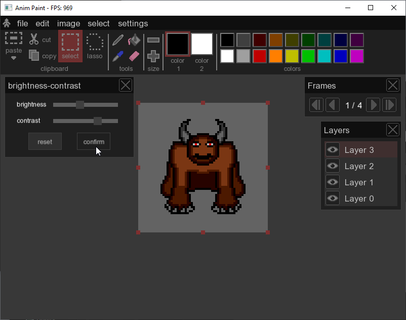
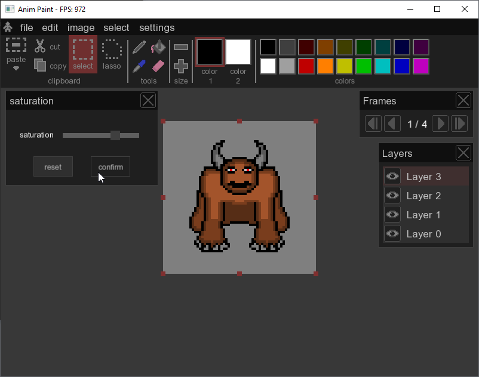
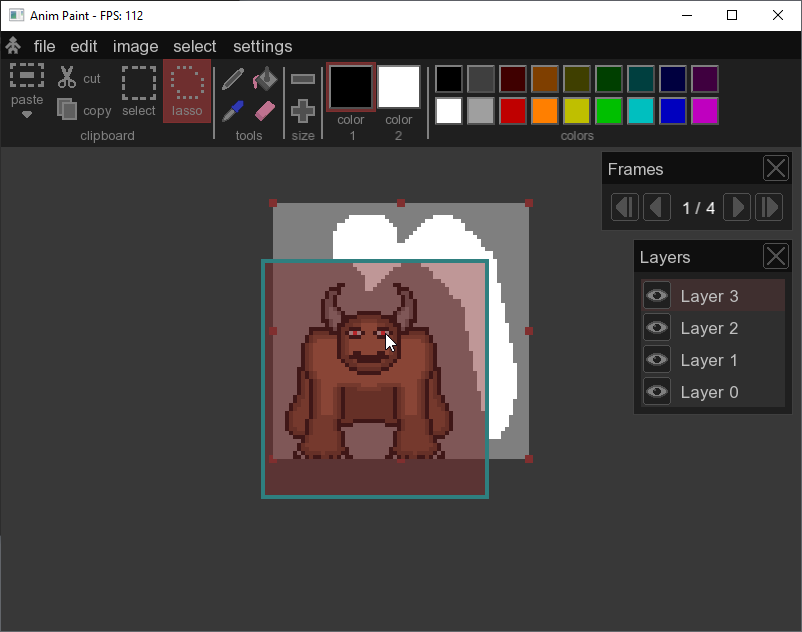

# Anim Paint

## Spis treści
- [Opis](#opis)
- [Zrzuty ekranu](#zrzuty-ekranu)
- [Instalacja](#instalacja)
- [Technologie](#technologie)
- [Licencja](#licencja)

## Opis
**Anim Paint**

## Zrzuty ekranu

## Instalacja
1. Pobierz i zainstaluj Visual Studio 2022
2. Pobierz i zainstaluje CMake
3. Pobierz bibliotekę SFML-3.0.2 (https://www.sfml-dev.org/) i umieść ją w katalogu `C:\SFML-3.0.2`.
4. Otwórz **Wiersz poleceń (cmd)**.
5. Przejdź do katalogu projektu:
`
cd ..\..\Anim Paint
`
6. Utwórz folder **build**:
`
mkdir build
`
7. Wejdź do folderu **build**:
`
cd build
`
8. Uruchom konfigurację projektu za pomocą **CMake**:
`
cmake ..
`
9. Zbuduj projekt:
`
cmake --build .
`

10. Plik wykonywalny znajdziesz w **build/Debug** lub **build/Release**

## Technologie
Program stworzono w języku C++ z wykorzystaniem biblioteki SFML 3.0.2.  
  
## Licencja
Licencja Otwarta – Uznanie autorstwa  
  
Ten program może być:  
-Pobierany  
-Kopiowany  
-Modyfikowany  
-Wykorzystywany w projektach prywatnych i komercyjnych  
  
Pod warunkiem, że:  
-Zachowana zostanie informacja o autorze oryginalnego programu  
-Podane zostanie źródło (link do repozytorium)  
-W przypadku modyfikacji, należy wyraźnie zaznaczyć, że program został zmodyfikowany oraz przez kogo.  